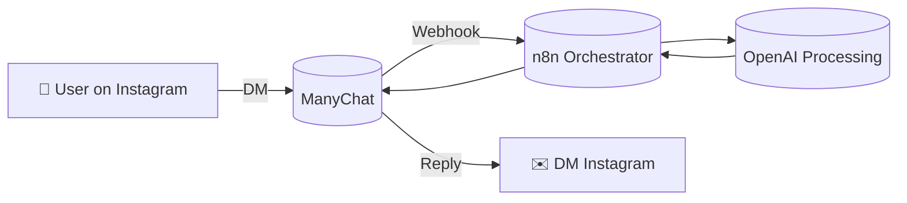

# manychat-n8n-integration
Integration flow between ManyChat and n8n to automate lead capture and responses.

---

# ManyChat → n8n Integration

This project demonstrates how to integrate **ManyChat** with **n8n** to automate message processing and responses.  
It is part of my portfolio of automation and AI secured projects.

---

## 📌 Features
- Receive messages from **Instagram DMs** via **ManyChat**.
- Process lead information and messages using **OpenAI** in **n8n**.
- Generate context-aware automated responses.
- Send the response back to **ManyChat**, which delivers it to the Instagram DM.

---

## ⚙️ Architecture

Import the manychat-n8n-flow.json into your n8n instance.

Configure credentials for:

ManyChat API Key

OpenAI API Key

Google Sheets (optional)

Gmail (optional)

Deploy and test by sending a DM on Instagram.

## 📸 Example Flow

### ManyChat Flow

### n8n Flow

## 🧑‍💻 Author
Created by Fran – CEO & Founder of Wraithvector  
Software & Automation Engineer | AI & Cybersecurity Applications

